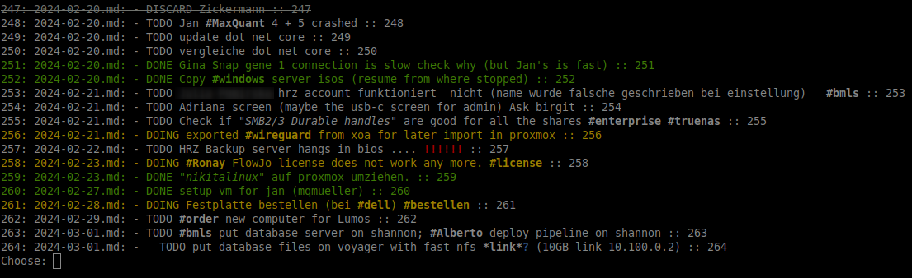

tt (nimTodo) a simple command line todo manager
====================



A tool that greps through files of a directory and list lines 
that contains "TODO" "DOING" "DONE" "DISCARD" with colors.

Then ask the user which file to open.

Read the "motivation" section why i wrote this
and why this tool is the backbone of my todo management.


Motivation
====================

I have tried several tools and methods to manage my work and personal to-do lists. 
While some of them were quite nice and packed with features, I could not stick to them for more than a few days. 
They were either too slow to open, not terminal-based, or not free.

I always come back to plain text files (using my own markdown “dialect”) where I write my to-dos with (neo)vim. 
I have used Obsidian in the past and liked the way it opened a daily diary file on start-up. 
Although I no longer use Obsidian, I still maintain diary files, which I edit with (neo)vim.

In the diary files, I document the things I do over the day and also add to-dos:
```

Some non todos 
bla bla

- TODO some stuff 
- DOING some stuff 
- DONE some stuff 

Some 
```

It started as a hack, but i now use it everyday, plaintext rulez :)

Usage
====================

```
$ tt -h
Usage:
  main [optional-params] 
`basePath` is the path which is searched when `absolutePath` is true print the whole pat when `json` is true print the output as json, the user is not asked then. when `quiet` is true, do not ask for the file
Options:
  -h, --help                                                         print this cligen-erated help
  --help-syntax                                                      advanced: prepend,plurals,..
  -b=, --basePath=    string  "/home/david/projects/obsidian/diary"  set basePath
  -p, --absolutePath  bool    false                                  Prints the whole path to the file
  -a, --showAll       bool    false                                  Also print `DONE` and `DISCARD` entries
  -q, --quiet         bool    false                                  Just print, do not ask the user
  -c, --clist         bool    false                                  Prints entries in the vim `quick fix list` format
  -d, --doingOnly     bool    false                                  set doingOnly
  -n, --newFile       bool    false                                  Opens the todays diary file
  -t, --tags          bool    false                                  prints all files with their tags
  -f, --tagsFiles     bool    false                                  prints all tags grouped together with their file
  --tagOpen=          string  ""                                     set tagOpen
  -g=, --grep=        string  ""                                     Filters entries by the given text, can be combined with `-a' `-d` etc.
  -o, --open          bool    false                                  Opens all the files found in the query, can be combined with `-a` `-d` `-g` etc.
  --ctags             bool    false                                  set ctags
```

Syntax
====================

tt (nimTodo) has some special syntax i like to use in the todo files.

```
- TODO *bright*
- TODO "italic"
- TODO !!!!!!!   <--- '!' is red and blinks
- TODO ???????   <--- '?' is blue
- TODO #tag
- TODO `literal`
```

Installation
====================

configure the config.ini to your liking.

i've created a symlink (do it how you like it):

/home/david/.local/bin/tt -> /home/david/projects/nimTodo/src/nimTodo


Neovim plugin/config
====================

Cycle
--------------------

To cycle through TODO -> DOING -> DONE -> DISCARD i use a vim plugin with this config.
On "ctrl + a" it cycles through the todo states

```
  use {
    "nat-418/boole.nvim",
    config = function()
      require('boole').setup({
        mappings = {
          increment = '<C-a>',
          decrement = '<C-x>'
        },
        -- User defined loops
        additions = {
          {'TODO', 'DOING', 'DONE', 'DISCARD'}
        },
        allow_caps_additions = {
          {'enable', 'disable'}
          -- enable → disable
          -- Enable → Disable
          -- ENABLE → DISABLE
        }
      })
    end
  }
```

todos as quick fix list
--------------------

```
-- Call `tt` and populate quick fix list
function populateClistFromTT() 
  vim.cmd(":cgetexpr system(\"tt -c -a -q\")")
  vim.cmd(":copen")
end
vim.cmd("noremap tt : lua populateClistFromTT() <CR>")

-- Put "TODO"
vim.cmd("nnoremap <leader>t :normal i TODO <CR>")
vim.cmd("inoremap <leader>t TODO")

-- Put timestamp
function putTimeStamp() 
  vim.cmd(":normal i " .. os.date("%Y.%m.%d__%H:%M:%S"))
end
vim.cmd("nnoremap <leader>m : lua putTimeStamp() <CR>")

-- Go to obsidian dir
vim.cmd("nnoremap <leader>o :split ~/projects/obsidian<CR>")

-- Open daily obisidan note
function openObsidianDailyNode()
 -- vim.cmd(":split ~/projects/obsidian/diary/" .. os.date("%Y-%m-%d.md"))
 -- vim.cmd(":tabnew ~/projects/obsidian/diary/" .. os.date("%Y-%m-%d.md"))
 vim.cmd(":e ~/projects/obsidian/diary/" .. os.date("%Y-%m-%d.md"))
end
vim.cmd("nnoremap <leader>d :lua openObsidianDailyNode()<CR>")
```


Bugs
====================

- DONE 001: After "!!" the text color is lost.

Changelog
====================

- 0.9.0 Added pre command (to run any command with the app, for "git add *; git commit" for example
- 0.8.0 Added ctags generation (with --ctags) and automatic ctags generation for tag completion
- 0.7.0 Added "DISCARD" (when a task will not be done)
- 0.5.0 Added "-n" to open todays diary file
- 0.4.0 Added Quotations (`) and (")
- 0.3.0 Colors and blink (!,?) align first number
- 0.2.0 Disable color and inputs when not on a tty (it works from vim)
